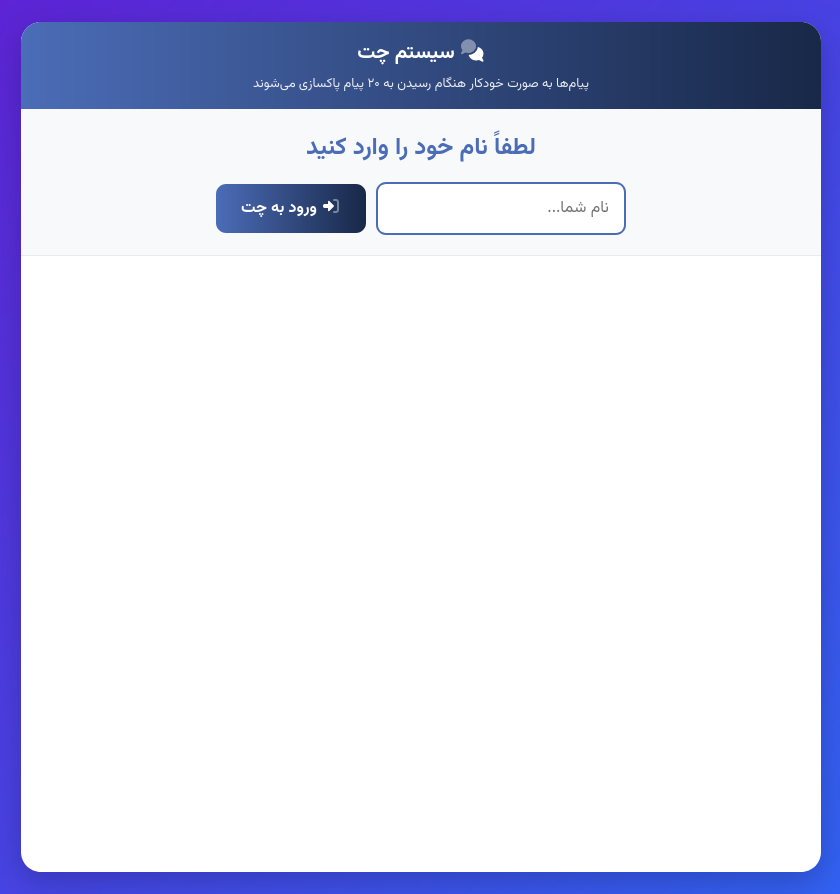
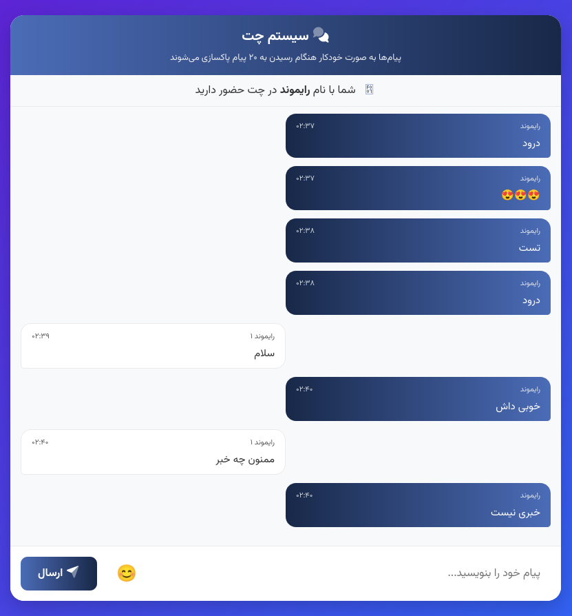

<p align="center">
    <picture>
        <source media="(prefers-color-scheme: dark)" srcset="./logo/logo.png">
        <source media="(prefers-color-scheme: light)" srcset="./logo/logo.png">
        
    </picture>
</p>

# PHPChat

A simple chat application written in PHP.

# Features

- Real-time messaging using AJAX
- User authentication with username only
- Automatic message cleanup (removes oldest messages when exceeding 20)
- Emoji support with built-in emoji picker
- Cross-Origin Resource Sharing (CORS) enabled
- Secure database operations using PDO prepared statements
- Responsive design for mobile and desktop
- Recent emojis stored in localStorage
- Auto-scrolling to latest messages
- Duplicate message prevention
- And simple and hassle-free installation

# Installation

1. Clone the repository
```bash
git clone https://github.com/Rayiumir/phpchat.git
cd PHPChat/
```

2. Create a database with the name `phpchat` for `DB_NAME`.
2. Create User Account for `DB_USER` and `DB_PASSWORD`.
3. import the `database.sql` file into your database.

# Screenshots

<table class="table">
<thead>
    <tr>
      <th scope="col" width="1000px">Username</th>
      <th scope="col" width="1000px">Room Chat</th>
    </tr>
  </thead>
  <tbody>
    <tr>
      <td>
        
      </td>
      <td>
        
      </td>
    </tr>
  </tbody>
</table>